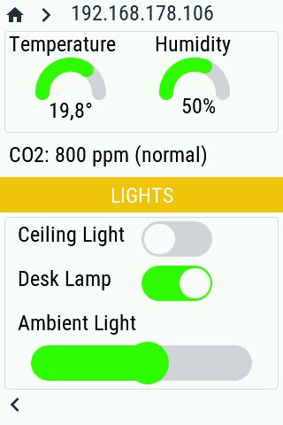

# Demo of WT32-SC01 ESP32 display with openHASP, Philips HUE, MQTT and node-RED
Display module: wireless-tag [WT32-SC01](https://www.seeedstudio.com/ESP32-Development-board-WT32-SC01-p-4735.html) (3.5" 320x480 capacitive multi-touch screen) ESP32 Development board.

# Demo

# 3d printed case

* on [cults3d](https://cults3d.com/en/users/printminion/creations)
* on [shapeways](https://www.shapeways.com/shops/printminion)
* follow me on Twitter [@printminion](https://twitter.com/printminion)

# Setup

## Setup WT32-SC01 with openHASP
* openHASP
https://openhasp.haswitchplate.com/0.6.1/devices/wt32-sc01/
* flash esp32
https://openhasp.haswitchplate.com/0.6.1/installation/esp32/

* edit config
  * open url
  * open file [config.json](./plate/config.json)
  * set WIFI
  * add MQTT server
* edit interface files
  * [offline.cmd](./plate/offline.cmd)
  * [online.cmd](./plate/offline.cmd)
  * [pages.jsonl](./plate/pages.jsonl)

* you can change screen rotation to 90°
* reboot
* check page #5

## Setup MQTT on Node-Red
* install node-red on raspberry pi
* install mqtt server
* use the flow (coming soon) to use the plate with mqtt server
